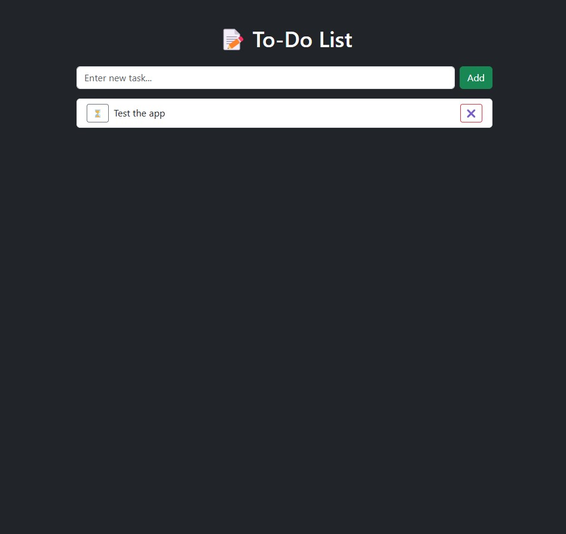

# 📝 PHP To-Do List App (Bootstrap 5 + MySQL)

This is a responsive, local-first To-Do List app built with PHP, MySQL, and Bootstrap 5.  
Tasks are stored in a MySQL database using secure, object-oriented PHP (PDO).  
Designed as a personal project and portfolio piece.

---

## 📦 Features

- Add new tasks  
- Toggle completion  
- Delete tasks with ✖  
- Task list stored in a MySQL database  
- Bootstrap 5 UI with custom dark styling  
- Localhost ready (WAMP, XAMPP, MAMP compatible)

---

## 🧱 Folder Structure
```bash
/To-Do-List/
├── index.php
├── database.php
├── task.php
├── images/
│   └── style.css
└── sql/
    └── init.sql
```

---

## ⚙️ Setup Instructions

1. Clone or download this repository into your localhost root (e.g. `www/To-Do-List`)
2. Import the provided SQL schema using phpMyAdmin or CLI:

```sql
CREATE DATABASE todo_app;

USE todo_app;

CREATE TABLE tasks (
    id INT AUTO_INCREMENT PRIMARY KEY,
    task VARCHAR(255) NOT NULL,
    done TINYINT(1) DEFAULT 0,
    created_at TIMESTAMP DEFAULT CURRENT_TIMESTAMP
);
```
Start your local server (WAMP, XAMPP, MAMP, etc.)

Open your browser and visit:
http://localhost/To-Do-List/

## 📸 Preview


## 💡 Future Plans
- Add search/filter functionality
- Sort by oldest/newest
- Add task categories or tags
- Display created_at timestamps
- Convert into Electron desktop app
- Add user login for multi-user support

## 🧠 Stack
- PHP (OOP + PDO)
- MySQL (MariaDB)
- Bootstrap 5
- Custom CSS (dark mode)
- Developed locally with WAMPServer

## 📃 License
MIT — Free to use, fork, and modify for personal or professional projects.
